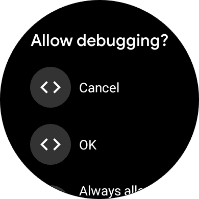
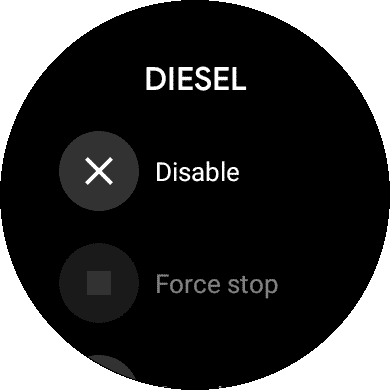

### This post has an accompanying [video here](https://youtu.be/zWobD9gfZPE).

 **Smart watches are the future! Everyone's gonna stop needing to pull out their phone for every little notification just to see if it's worth responding to. You'll just flick your wrist, and even if your hands are full, you'll know whether you need to get back to it right now, and even send short messages straight from the watch! Some people won't even leave the house with their phones sometimes because, with a data connection, you'll be able to do basically everything standalone too!**

**\- People in the mid 2010s**

They were wrong, which is integral to my point that debloating my watch was 100% necessary for it to be of any use to me. Well, that and the fact that the out-of-the-box software experience is almost unbelievably slow.

## So you've got a Wear OS watch... now what?

What are you going to do with it? (Specifically, my "it" is a red Fossil Sport) Yes, recieve notifications on your wrist, but what else? There are email clients, music apps, workout trackers, games, all of which *work*, but I question how many people actually use them.

Admittedly, a lot of the appeal of a smartwatch for me when I was younger was the ability to play games on my watch since phones were banned at all times in a previous school of mine. At one point, therefore, I DID care about it being able to do lots of things separately from my phone, and there are absolutely hacky ways to get things done. The fact that there are working browsers, and the ability to sideload **real, full android apps**, means that the platform has the capability to do lots. 

The problem is, I don't need that anymore.

*Now,* the purpose of a smartwatch is to give me IMMEDIATE access to notficiations (both to help me read them faster, and to ensure that I actually notice them because my phone is set to silent mode because I'M CONSIDERATE OF OTHERS IN PUBLIC and sometimes the vibration of my phone is too weak) and media controls. I'm mostly joking about how much I dislike others' notification sounds, but they do embarass me so I do need them turned off myself.

## And can't the watch already do those things?

Yes, my watch can already do those two simple things. The problem is, it's really really slow. Below is a GIF of me just trying to open the notification menu on my watch as it comes stock. That is a 30fps gif, it's realtime.


This is not constant, but it's often enough that it encourages me to never bother using the watch, since my phone coming out of my pocket is at least a consistent speed, if slower sometimes. 

Most importantly, this sloweness is not necessary, and can be *so much worse*. Why don't I sign in on my watch? One reason is that the play store just seems to install more things I don't need, slowing the watch to the point of *constantly* feeling terrible, and making it almost unusable while installing those things. I've had my watch take 20 seconds to open the app drawer before. I can feel the watch getting hot, which on one hand is a little bit cool, and really just proves the point that it's not magic, it's just a slow computer on my wrist, but is also not what I want. 

## So how do I solve it?

Well, the title says debloat, and that's a bit of it, but also just general optimisations.

### Optimisations:
- Go into **developer settings** (which can be enabled the same as on regular android), set **animation scales to .5x**, and disable **"Automatically enable Wi-Fi when charging"**. The animation scale is just something I do on every android device because it makes things feel so much snappier, but the Wi-Fi settings change will be explained together with the next point:
- Go into **connection settings**, **unsave every Wi-Fi network**, then **turn Wi-Fi off**. Preventing the use of Wi-Fi is really important for improving Wear OS watches, since - with Wi-Fi on - they seem to heat up, use more battery, and (maybe as a throttling mechanism to try to limit the battery loss) tend to then perceivably slow down.
- This is potentially a **Fossil exclusive step**, I'm not sure. In the **quick settings**, I tap **battery**, and I get options for configuring a **custom battery profile**. I think their intent was for people to switch between the built-in presets and your own custom one in order to most perfectly optimise performance/features vs battery life in every situation... but for me this is just a second place to set some settings to make sure they never change. In that custom battery profile, I **enable the always-on display and bluetooth (without using schedules for it)**, then **disable everything else**. Bluetooth's schedule being "off" doesn't mean bluetooth is off, it just means that the schedule that disables bluetooth will never disable it. Below, I've stitched together some screenshots to try to show you those menus. *"Aren't you just wasting most of the capabilities of the watch if it's all turned off?"* No. I don't want the bits that are off. Also, *is having the always on display enabled an optimisation?* No. I just need it on.


#### Other settings I change just because:
- This section isn't optimisations, just things that make my watch better.
- I go into **app settings**, notifications, and set the vibration to **double** mode because it's more attention-grabbing.
- **Display settings**, make the **font size small** so more text can fit on screen, also obviously **always on display** should be enabled but I said that before.
- Make sure **all gestures are disabled**
- Make sure **bluetooth is the only thing on** in **connectivity settings**
- In **general**, make sure **auto launch media controls** and **show unread dot** are on.
- As a thing **specific to this watch** (or others with extra **hardware buttons**, this has 2 + the digital crown), I set the **top one to media controls** - since sometimes they don't auto-launch, or I dismiss them while doing other things - and the **bottom one to the torch** since it's actually sometimes very useful.

### Debloating:
To debloat a Wear OS watch, you first need to find a way to connect it to a computer. If you're still using a much older watch, it might even have a USB port. Most likely though, it doesn't. Some people debug over Wi-Fi, but I've always had bad luck with that, so here's how I do it:

- On the watch: Settings -> System -> About -> Build number press 7 times, then
Settings -> Dev --> Tick ADB Debug, Tick Debug over bluetooth
- On the phone: Wear OS App -> Settings -> Advanced -> Tick debugging over bluetooth. Hope and pray that it says **"Target: Connected"** and that you soon get a notification saying **"Debugging over Bluetooth"**.
Enable dev settings and USB debugging on phone too.
- On a PC: Connect your phone, and have ADB installed. Search how to do this for your OS. It's easier on Mac and Linux. Then, either your phone will prompt you already for **debugging permission (say yes)**, or it won't yet, so you'll want to run `adb shell` and it should prompt you now.
- With ADB now working: run this, then accept the prompt on your watch.
```
adb forward tcp:4444 localabstract:/adb-hub
adb connect localhost:4444
```
You'll get a `failed to authenticate to localhost:4444` message, but you'll also get a prompt on the watch that you should accept.


- With your watch now connected to your PC, it's possible to debloat - or just mess in the terminal. If you want to see your watch's running processes, you can run `adb -e shell top`.


**Don't follow these instructions yet, as I made a mistake**
Anyway, now it's time to figure out what you want to remove. If you run `adb -e shell pm list packages`, you'll be presented with a list of the installed packages on your watch. For each that you want to remove, you'll then run `adb -e shell pm uninstall --user 0 package.name`.

Here is the list of packages I removed:
- com.nike.plusgps
- com.google.android.apps.translate
- com.spotify.music
- com.google.android.wearable.assistant
- com.fossil.wearables.watchfaces
- com.google.android.wearable.reminders
- com.fossil.oemsetup.darter
- com.google.android.apps.fitness
- com.android.providers.contacts
- com.google.android.apps.handwriting.ime
- com.google.android.googlequicksearchbox
- com.android.providers.calendar
- com.google.android.apps.walletnfcrel

I disabled these in the app settings afterwards, (or removed installed upgrades if that was the only option) and I'm pretty sure you'll see the issue.

- Diesel
- Fit
- Fossil
- Google
- Play store
- Wallet
- Kate Spade watch faces
- Keep
- Misfit
- MK Access
- Mobvoi Account
- PUMA Apps
- Reminders (both of them) 
- Sogou Map
- Ticexercise
- Tichealth
- Ticranking
- Ticstore
- Translate
- The apps that had chinese characters as names

#### And then some weirdness

I already removed some of those, yet they were still here. That's because I forgot the `-u` flag when listing the packages, which includes hidden and uninstalled packages. To *REALLY* list all packages, you should run `adb -e shell pm list packages -u`. Trying `-e` just gave the same results and my earlier command (things stayed hidden), and `-d` shows no results for me at all for some reason.

So sadly, for now at least, I have to leave this debloating section in a weird place. I can now list all of the extra packages, but no matter what command I run, I cannot get them to be uninstalled, as I either get `Failure [not installed for 0]`, or `Failure [not installed for 0]`. However, at least many apps *really are* uninstalled, and those others are disabled.

### Sideloading:
Although we're nearly done, there's one more step. How do I get my favourite open source watch face? And potentially other apps, but I don't need them myself. I don't use the playstore since it seems to install lots of other extra stuff. 

[Pixel WatchFace](https://github.com/CorvetteCole/PixelWatchFace) is a watch face that's open source, meaning I can - without breaking any TOS, as an APK site pulling from the playstore's proprietary apps may, get the apk for it from Github, and just run `adb -e install ~/Downloads/wearApp-release.apk`, and waiting a little bit for it to transfer and install over bluetooth. Now I've got my favourite watch face without needing to use an appstore, which is important since I removed the Fossil ones earlier so I'm stuck with this:
 


That install process works with any app you find, so this will be useful for people wanting to keep their setups as minimal and purposeful as possible.

## Results
- **A faster watch with longer battery life and a less cluttered interface.**

- **A watch that doesn't randomly heat up or freeze**

- **A "fun" learning experience from doing all of this to the watch**

I really do apologise for the debloating section going awry. I'm not sure why sometimes it acts differently. The first time I tried this (many factory resets ago), it didn't do this, and every time it's been a little bit different. Also I should mention here, disable your ADB debugging in the Wear OS app / phone, and on your watch now.

I hope regardless that you enjoyed or learned something. I know - and acknowledged in my [video about this](https://youtu.be/zWobD9gfZPE) - that there's a reddit post and some Github issues related to debloating fossils, but I hope that this was a nice way to present it all, along with my own findings.